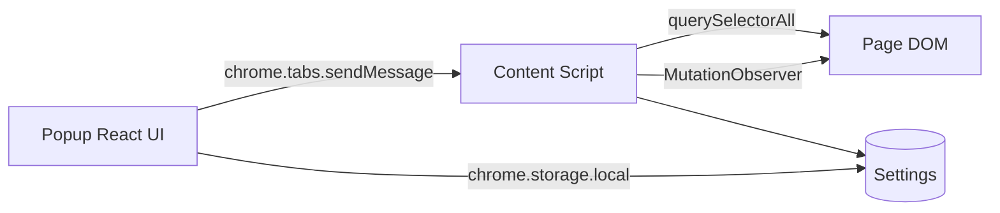

# Price Converter

A **Chrome Extension (Manifest V3)** that converts prices on any webpage. Point at a price, set a rate, and see converted values inline—without leaving the page.

Built for real-world shopping sites (Digikala, Amazon, schema.org markup, and generic e-commerce patterns).

---

## Features

| Feature | Description |
|--------|-------------|
| **Auto-detect** | Finds prices via `data-testid`, schema.org, site profiles, and heuristics |
| **Manual pick** | Click any price on the page; selector is generated automatically |
| **Custom rate** | Divide or multiply by any rate you set (e.g. Toman → USD) |
| **Persian / Arabic digits** | Parses `۰–۹` and `٠–٩` correctly |
| **Live updates** | Watches DOM changes (SPAs, lazy-loaded prices) |
| **Stop / reset** | Remove all conversion badges with one click |
| **Settings persist** | Selector, rate, and symbol saved in `chrome.storage` |

### Supported auto-detect targets (examples)

- **Digikala** — `[data-testid="price-final"]`, legacy `.text-h4`, …
- **Amazon** — `.a-price .a-offscreen`, …
- **Generic** — `[itemprop="price"]`, `[data-testid*="price"]`, price-like classes

---

## Quick start

### Requirements

- [Node.js](https://nodejs.org/) 18+
- [pnpm](https://pnpm.io/) 10+ (recommended)
- Google Chrome or Chromium

### Install & build

```bash
git clone <your-repo-url>
cd price-converter-ext
pnpm install
pnpm run build
```

### Load in Chrome

1. Open `chrome://extensions`
2. Enable **Developer mode**
3. Click **Load unpacked**
4. Select the **`dist/`** folder (not the repo root)

After code changes:

```bash
pnpm run build
```

Then click **Reload** on the extension card in `chrome://extensions`.

### Watch mode (development)

```bash
pnpm run dev
```

Rebuilds `dist/` on file changes. Reload the extension in Chrome after each build.

---

## How to use

1. Open a product or listing page (e.g. Digikala, Amazon).
2. Click the extension icon to open the popup.
3. Click **تشخیص خودکار** (auto-detect).  
   If nothing is found → **انتخاب دستی** and click a price on the page.
4. Enter your **conversion rate** (required, must be &gt; 0).
5. Choose **operation** (divide / multiply) and optional **output symbol** (e.g. `USD`).
6. Click **اعمال روی صفحه** to apply conversion badges.
7. Click **حذف تبدیل‌ها** to remove badges and stop observing the page.

### Example: Toman → USD

| Field | Value |
|-------|--------|
| Operation | تقسیم بر نرخ (divide) |
| Rate | `177000` |
| Symbol | `USD` |

Result: each matched price shows a yellow badge like `≈ 12.50 USD`.

---

## Scripts

| Command | Description |
|---------|-------------|
| `pnpm install` | Install dependencies |
| `pnpm run build` | Typecheck + popup + **single-file** `content.js` → `dist/` |
| `pnpm run dev` | Watch mode rebuild |
| `pnpm run typecheck` | TypeScript only (`tsc -b`) |

---

## Tech stack

- **Manifest V3** — Chrome extension APIs (`scripting`, `storage`, `tabs`)
- **React 19** + **TypeScript** — Popup UI
- **Vite 8** — Build (popup + content script bundles)
- **Tailwind CSS 3** — Popup styling
- **Content script** — DOM conversion, element picker, auto-detect

---

## Project structure

```
price-converter-ext/
├── public/
│   └── manifest.json       # Extension manifest (copied to dist/)
├── src/
│   ├── content/
│   │   ├── content.ts      # Conversion engine + message handler
│   │   └── picker.ts       # Click-to-select overlay on page
│   ├── popup/
│   │   ├── Popup.tsx       # Main UI
│   │   ├── main.tsx
│   │   └── index.css
│   └── shared/
│       ├── autoDetect.ts   # Price detection heuristics
│       ├── siteProfiles.ts # Per-site CSS selector priorities
│       ├── generateSelector.ts
│       ├── purifyNumber.ts # Persian/Arabic digit parsing
│       ├── chrome.ts       # Tab / content-script helpers
│       ├── constants.ts
│       └── types.ts
├── popup.html
├── vite.config.ts
├── tsconfig.json           # Project references (app + node)
└── dist/                   # Build output — load this in Chrome
```

---

## Architecture (high level)



**Message types** (popup → content):

- `PING` — health check / inject if missing
- `AUTO_DETECT` — scan page for price selectors
- `START_PICKER` — interactive element picker
- `START_CONVERSION` — apply badges with config
- `STOP_CONVERSION` — remove badges and disconnect observer

---

## Extending auto-detect

Add hostname-specific selectors in `src/shared/siteProfiles.ts`:

```ts
'example.com': [
  {
    selector: '[data-testid="product-price"]',
    score: 100,
    reason: 'Example shop product price',
  },
],
```

Higher `score` = higher priority when multiple candidates match.

---

## Permissions

| Permission | Why |
|------------|-----|
| `activeTab` | Run on the current tab when you open the popup |
| `scripting` | Inject content script if the page loaded before install |
| `storage` | Save conversion settings and picked selector |
| `<all_urls>` | Work on any shopping site you visit |

---

## Known limitations

- Does not run on `chrome://`, `edge://`, or extension pages.
- Auto-detect may fail on heavily obfuscated or custom DOM; use **manual pick**.
- Very broad selectors can match too many nodes; prefer site profiles or manual pick.
- Conversion is **display-only**; it does not change checkout or server prices.

---

## Troubleshooting

| Problem | Try |
|---------|-----|
| Nothing happens on apply | Refresh the page, reload the extension, pick again |
| Auto-detect fails | Use manual pick; check advanced CSS selector |
| Wrong prices converted | Re-pick a more specific element |
| Badges duplicate | Click **حذف تبدیل‌ها**, then apply again |

---

## License

ISC (see `package.json`). Use at your own risk.

---

## Disclaimer & attribution

> **This project was completely implemented with [Cursor](https://cursor.com) AI agents** — primarily **Composer 2.5** and **Opus 4.7** — based on user prompts and iterative feedback.
>
> The repository owner **does not claim original authorship of the implementation** and **is not responsible** for:
>
> - Bugs, security issues, or incorrect price conversions  
> - Compatibility with third-party websites or future DOM changes  
> - Any financial, legal, or purchasing decisions made using converted prices  
> - Chrome Web Store policy compliance if you publish or redistribute this extension  
>
> Software is provided **“AS IS”**, without warranty of any kind. You are solely responsible for reviewing, testing, and deploying any build before use.
>
> If you fork or ship this extension, you should run your own security review and add appropriate store listings, privacy policy, and icon assets.

---

## Author note

Maintained as an open learning / utility project. Contributions welcome (especially `siteProfiles` for more stores). For issues, open a GitHub issue with the URL, expected behavior, and a screenshot if possible.
